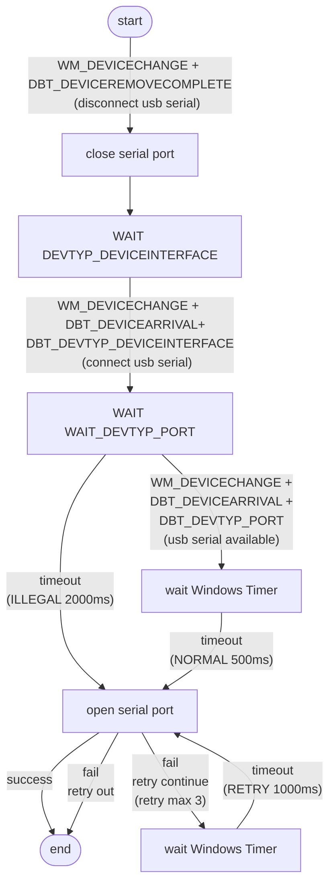

```mermaid
flowchart
    start([start])
    start -- WM_DEVICECHANGE + DBT_DEVICEREMOVECOMPLETE
    (disconnect usb serial)
     --> id0
    id0[close serial port]
    id0 --> id1
    id1[WAIT DEVTYP_DEVICEINTERFACE]
    id1 --
    WM_DEVICECHANGE + 
    DBT_DEVICEARRIVAL+ DBT_DEVTYP_DEVICEINTERFACE
    (connect usb serial)
    --> id2
    id2 -- timeout
    (ILLEGAL 2000ms)
    --> id4
    id2[WAIT WAIT_DEVTYP_PORT]
    id2 -- WM_DEVICECHANGE +
    DBT_DEVICEARRIVAL +
    DBT_DEVTYP_PORT
    (usb serial available)
    --> id3
    id3[wait Windows Timer]
    id3 -- timeout
    (NORMAL 500ms) --> id4
    id4[open serial port]
    id4 -- success --> end1
    id4 -- fail
    retry continue
    (retry max 3) --> id5
    id5[wait Windows Timer]
    id5 -- timeout
    (RETRY 1000ms) --> id4
    id4 -- fail
    retry out --> end1
    end1([end])
```
